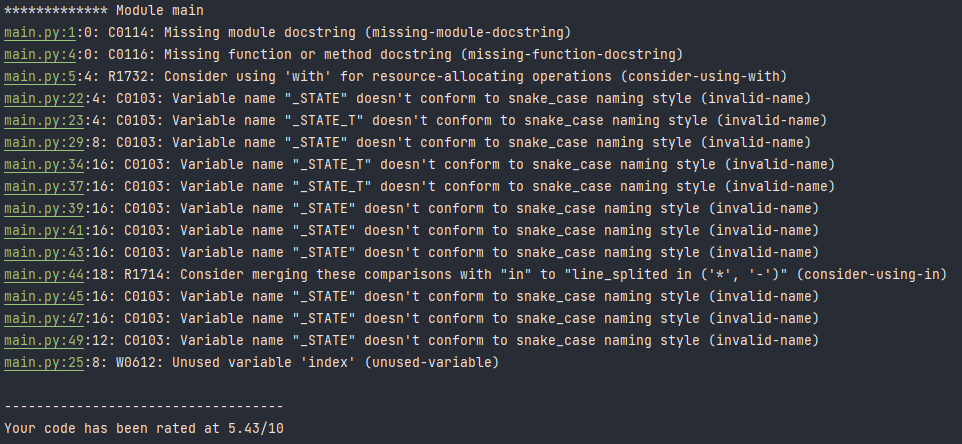

# Project automate course

## About me

Maitrisant tout d'abord les technologies Javascript et étant plus orienté dans le front-end,
je voulais expérimenter des algorithmes et automates.

Voulant sortir de ma zone de confort, je suis premièrement partie sur Golang pour ce projet d'automate
puis finalement je suis partie sur le langage Python. Un langage qui m'a beaucoup séduit avec quelques
petites difficultés liée au langage lui-même mais rien de bloquant !

---

J'ai donc développer un minimum fonctionnel de cette app à cause de la perte de temps que j'ai cumulé
Mais j'ai pour but de le rendre totalement fonctionnel avec plusieurs choix de conversion
sur un Bot Discord !

*Bref l'historique de mon code se trouve dans les commits :D*

## The project

### Dependencies

```
pylint==2.8.2
py-heat==0.0.6
```

### Pylint

Linter was configured in `.pylintrc` file

#### First step with pylint rated at 5.43



#### After the third step rated at 9.14


### Py-heat

#### Monitoring heatmap

*Sur cette image j'ai été récupérer le moment le plus lent de mon code pour différencier
les blocs de code découpés*

