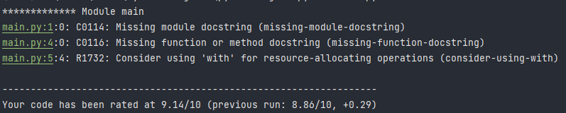

# Project automate

Manage by: *Renaud ANGLES*

## About me

Maitrisant tout d'abord les technologies Javascript et étant plus orienté dans le front-end,
je voulais expérimenter des algorithmes et automates.

Voulant sortir de ma zone de confort, je suis premièrement partie sur Golang pour ce projet d'automate
puis finalement je suis partie sur le langage Python. Un langage qui m'a beaucoup séduit avec quelques
petites difficultés liée au langage lui-même mais rien de bloquant !

---

J'ai donc développer un minimum fonctionnel de cette app à cause de la perte de temps que j'ai cumulé
Mais j'ai pour but de le rendre totalement fonctionnel avec plusieurs choix de conversion
sur un Bot Discord !

*Bref l'historique de mon code se trouve dans les commits :D*

## The project

### Logs book

   - Dans un premier temps j'ai eu pas mal de blocage avec la partie gestion d'état de l'application
pour pouvoir détecter correctement les exceptions
   - De petits retard par rapport au fait que je ne maitrise pas le langage dans lequel 
je developpe cet automate
   - Je n'ai pas eu de problème dans la direction même du projet avec la documentation et le support
du formateur

### Dependencies

```
pylint==2.8.2
py-heat==0.0.6
```

### Pylint

Linter was configured in `.pylintrc` file

#### First step with pylint rated at 5.43


#### After the third step rated at 9.14



### Py-heat

#### Monitoring heatmap

*Sur cette image j'ai récupéré la partie la plus lente de mon code pour différencier
les blocs découpés*


### SonarQube

J'ai mis en place dans la racine du projet un fichier `docker-compose.yml` qui permet de monter deux
containers avec SonarQube et une base donnée liée en PostgresQL

Pour la partie **sonar-scanner** j'ai pas réussi à le monter correctement dans le *docker-compose*
mais je l'ai lancer avec la commande suivante:

```shell
docker run --rm -e SONAR_HOST_URL="http://evankhell:9000" -e SONAR_LOGIN="5faff1abc11194c8e31fdde397061a1d5dc6a3ba" -v "/home/qqmelon/cours-project/course-automate-converter:/usr/src" sonarsource/sonar-scanner-cli -D sonar.projectKey=proutKey
```

Et donc sur la partie webapp de sonar j'ai:

